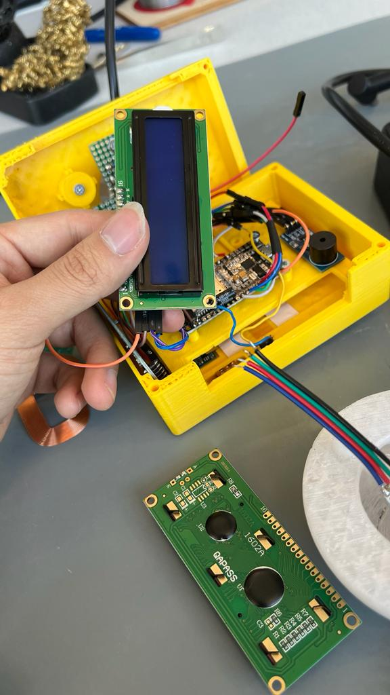

# ut_BuzzerForGamification
Buzzer intended for gamify the lectures at the UT.

## Circuit Diagram

**Requirements:**
- ESP32
- RFID reader
- Buttons
- On/Off switch
- Buzzer Module
- Wireless charger receiver
- 12x2 LCD Display
- Lipo Battery

**Built With:**
- C++
- SolidWorks
- Circuito.io
- Arduino IDE

**Assembly:**

## Authors:

- Bryan Sanchez
